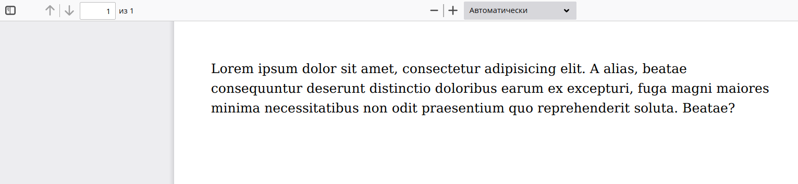
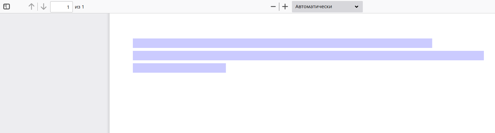
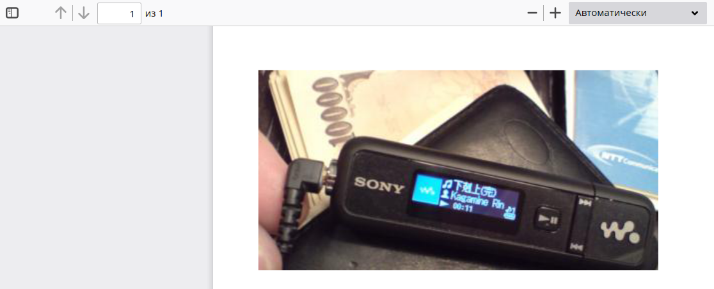
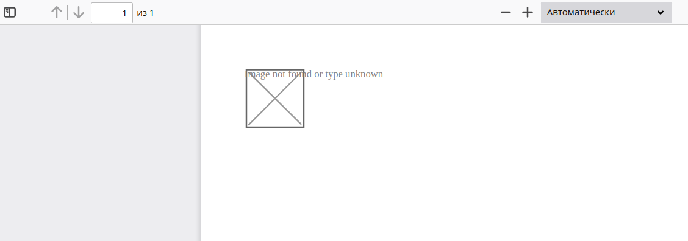

## Preparation

1. Start container

    ```bash
    docker-compose up -d
    ```

2. Connect to container and install dependencies

    ```bash
    docker-compose exec app su-exec nginx bash
    cd 0.8.5 && composer install && cd ..
    cd 0.8.6 && composer install && cd ..
    ```

## Reproduce DejaVu fonts issue

[Issue with broken DejaVu fonts][dejavu-issue] reproducible with `mbstring.func_overload=2`
(enabled by env variable `SOF_PRESET=bitrix`)

### Test with 0.8.5

Open in browser `http://localhost:8888/0.8.5/dejavu-fonts.php`



### Test with 0.8.6

Open in browser `http://localhost:8888/0.8.6/dejavu-fonts.php`



## Reproduce images issue

[`Image not found or type unknown` issue][images-issue] reproducible even with `SOF_PRESET=default`

### Test with 0.8.5

Open in browser `http://localhost:8888/0.8.5/images.php`



### Test with 0.8.6

Open in browser `http://localhost:8888/0.8.6/images.php`



[dejavu-issue]: https://github.com/dompdf/dompdf/issues/2298
[images-issue]: https://github.com/dompdf/dompdf/issues/2302
